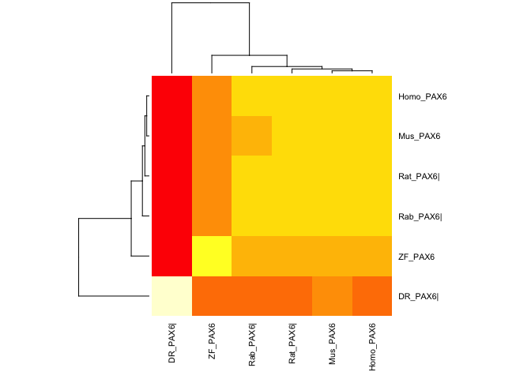
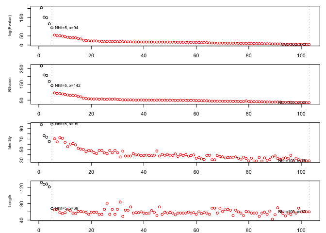

Untitled
================

``` r
library(bio3d)
seq <- read.fasta("Find_A_Gene_Project.fst")
ide.mat <- seqidentity(seq, normalize=TRUE, similarity=FALSE, ncore=1, nseg.scale=1)
```

``` r
heatmap(ide.mat, cexRow = 0.8, cexCol = 0.8)
```



``` r
con.seq <- consensus(seq)
con.seq = print(con.seq$seq)
```

    ##   [1] "-" "-" "-" "-" "-" "-" "-" "-" "-" "-" "-" "-" "-" "-" "-" "-" "-"
    ##  [18] "-" "-" "-" "-" "-" "-" "-" "-" "-" "-" "M" "Q" "N" "S" "H" "S" "G"
    ##  [35] "V" "N" "Q" "L" "G" "G" "V" "F" "V" "N" "G" "R" "P" "L" "P" "D" "S"
    ##  [52] "T" "R" "Q" "K" "I" "V" "E" "L" "A" "H" "S" "G" "A" "R" "P" "C" "D"
    ##  [69] "I" "S" "R" "I" "L" "Q" "-" "-" "-" "-" "-" "-" "-" "-" "-" "-" "-"
    ##  [86] "-" "-" "-" "V" "S" "N" "G" "C" "V" "S" "K" "I" "L" "G" "R" "Y" "Y"
    ## [103] "E" "T" "G" "S" "I" "R" "P" "R" "A" "I" "G" "G" "S" "K" "P" "R" "V"
    ## [120] "A" "T" "P" "E" "V" "V" "S" "K" "I" "A" "Q" "Y" "K" "R" "E" "C" "P"
    ## [137] "S" "I" "F" "A" "W" "E" "I" "R" "D" "R" "L" "L" "S" "E" "G" "V" "C"
    ## [154] "T" "N" "D" "N" "I" "P" "S" "V" "S" "S" "I" "N" "R" "V" "L" "R" "N"
    ## [171] "L" "A" "S" "E" "K" "Q" "Q" "M" "G" "A" "D" "G" "M" "Y" "D" "K" "L"
    ## [188] "R" "M" "L" "N" "G" "Q" "T" "G" "S" "W" "G" "T" "R" "P" "G" "W" "Y"
    ## [205] "P" "G" "T" "S" "V" "P" "G" "Q" "P" "T" "Q" "D" "G" "C" "Q" "Q" "Q"
    ## [222] "E" "G" "G" "G" "E" "N" "T" "N" "S" "I" "S" "S" "N" "G" "E" "D" "S"
    ## [239] "D" "E" "A" "Q" "M" "R" "L" "Q" "L" "K" "R" "K" "L" "Q" "R" "N" "R"
    ## [256] "T" "S" "F" "T" "Q" "E" "Q" "I" "E" "A" "L" "E" "K" "E" "F" "E" "R"
    ## [273] "T" "H" "Y" "P" "D" "V" "F" "A" "R" "E" "R" "L" "A" "A" "K" "I" "D"
    ## [290] "L" "P" "E" "A" "R" "I" "Q" "V" "W" "F" "S" "N" "R" "R" "A" "K" "W"
    ## [307] "R" "R" "E" "E" "K" "L" "R" "N" "Q" "R" "R" "Q" "A" "S" "N" "T" "P"
    ## [324] "S" "H" "I" "P" "I" "S" "S" "S" "F" "S" "T" "S" "V" "Y" "Q" "P" "I"
    ## [341] "P" "Q" "P" "T" "T" "P" "V" "S" "S" "F" "T" "S" "G" "S" "M" "L" "G"
    ## [358] "R" "T" "D" "T" "A" "L" "T" "N" "T" "Y" "S" "A" "L" "P" "P" "M" "P"
    ## [375] "S" "F" "T" "M" "A" "N" "N" "L" "P" "M" "Q" "P" "P" "V" "P" "S" "Q"
    ## [392] "T" "S" "S" "Y" "S" "C" "M" "L" "P" "T" "S" "P" "S" "V" "N" "G" "R"
    ## [409] "S" "Y" "D" "T" "Y" "T" "P" "P" "H" "M" "Q" "T" "H" "M" "N" "S" "Q"
    ## [426] "P" "M" "G" "T" "S" "G" "T" "T" "S" "T" "G" "L" "I" "S" "P" "G" "V"
    ## [443] "S" "V" "P" "V" "Q" "V" "P" "G" "S" "E" "P" "D" "M" "S" "Q" "Y" "W"
    ## [460] "P" "R" "L" "Q"

``` r
paste(con.seq, collapse = '')
```

    ## [1] "---------------------------MQNSHSGVNQLGGVFVNGRPLPDSTRQKIVELAHSGARPCDISRILQ--------------VSNGCVSKILGRYYETGSIRPRAIGGSKPRVATPEVVSKIAQYKRECPSIFAWEIRDRLLSEGVCTNDNIPSVSSINRVLRNLASEKQQMGADGMYDKLRMLNGQTGSWGTRPGWYPGTSVPGQPTQDGCQQQEGGGENTNSISSNGEDSDEAQMRLQLKRKLQRNRTSFTQEQIEALEKEFERTHYPDVFARERLAAKIDLPEARIQVWFSNRRAKWRREEKLRNQRRQASNTPSHIPISSSFSTSVYQPIPQPTTPVSSFTSGSMLGRTDTALTNTYSALPPMPSFTMANNLPMQPPVPSQTSSYSCMLPTSPSVNGRSYDTYTPPHMQTHMNSQPMGTSGTTSTGLISPGVSVPVQVPGSEPDMSQYWPRLQ"

``` r
identities <- rowSums(ide.mat)
identities
```

    ##  DR_PAX6|   ZF_PAX6 Rab_PAX6| Rat_PAX6| Homo_PAX6  Mus_PAX6 
    ##     5.781     5.907     5.928     5.932     5.942     5.940

``` r
blast.seq <- blast.pdb(con.seq)
```

    ##  Searching ... please wait (updates every 5 seconds) RID = 8JJ1677V014 
    ##  ..
    ##  Reporting 103 hits

``` r
blast.seq
```

    ## $hit.tbl
    ##          queryid subjectids identity alignmentlength mismatches gapopens
    ## 1   Query_207433     6PAX_A   97.727             132          3        0
    ## 2   Query_207433     1K78_A   76.378             127         30        0
    ## 3   Query_207433     2K27_A   73.438             128         34        0
    ## 4   Query_207433     1PDN_C   65.289             121         42        0
    ## 5   Query_207433     2CUE_A   98.529              68          1        0
    ## 6   Query_207433     3A01_B   70.769              65         19        0
    ## 7   Query_207433     2M0C_A   64.615              65         23        0
    ## 8   Query_207433     3LNQ_A   72.414              58         16        0
    ## 9   Query_207433     3A02_A   71.429              56         16        0
    ## 10  Query_207433     3CMY_A   63.793              58         21        0
    ## 11  Query_207433     1FJL_A   55.385              65         29        0
    ## 12  Query_207433     2MGQ_A   60.317              63         25        0
    ## 13  Query_207433     2DMU_A   61.404              57         22        0
    ## 14  Query_207433     2DMS_A   58.929              56         23        0
    ## 15  Query_207433     2L7M_P   52.459              61         29        0
    ## 16  Query_207433     2L7F_P   50.820              61         30        0
    ## 17  Query_207433     2K40_A   50.000              60         30        0
    ## 18  Query_207433     2M34_A   45.763              59         32        0
    ## 19  Query_207433     5Z2T_C   48.148              54         28        0
    ## 20  Query_207433     1JGG_A   47.458              59         31        0
    ## 21  Query_207433     2H1K_A   44.068              59         33        0
    ## 22  Query_207433     2N8G_A   42.373              59         34        0
    ## 23  Query_207433     6A8R_B   48.148              54         28        0
    ## 24  Query_207433     5Z6Z_A   48.148              54         28        0
    ## 25  Query_207433     5Z6Z_A   43.939              66         32        1
    ## 26  Query_207433     3A01_A   41.975              81         44        2
    ## 27  Query_207433     6E8C_A   48.148              54         28        0
    ## 28  Query_207433     6E8C_A   43.939              66         32        1
    ## 29  Query_207433     5ZFW_A   48.148              54         28        0
    ## 30  Query_207433     5ZFW_A   43.939              66         32        1
    ## 31  Query_207433     2R5Y_A   35.714              84         40        1
    ## 32  Query_207433     5Z2S_A   46.939              49         26        0
    ## 33  Query_207433     1AHD_P   37.500              64         40        0
    ## 34  Query_207433     1HOM_A   37.500              64         40        0
    ## 35  Query_207433     4UUS_A   37.500              72         41        1
    ## 36  Query_207433     2DMQ_A   42.105              57         33        0
    ## 37  Query_207433     4XIC_A   39.655              58         35        0
    ## 38  Query_207433     9ANT_A   39.655              58         35        0
    ## 39  Query_207433     2DMT_A   38.333              60         37        0
    ## 40  Query_207433     2HDD_A   38.596              57         35        0
    ## 41  Query_207433     1DU0_A   39.286              56         34        0
    ## 42  Query_207433     1HDD_C   38.596              57         35        0
    ## 43  Query_207433     6ES3_K   38.095              63         39        0
    ## 44  Query_207433     5LUX_K   38.983              59         36        0
    ## 45  Query_207433     2E1O_A   47.059              51         27        0
    ## 46  Query_207433     4CYC_A   37.500              72         41        1
    ## 47  Query_207433     3A03_A   40.741              54         32        0
    ## 48  Query_207433     6ES2_K   38.983              59         36        0
    ## 49  Query_207433     1ZTR_A   40.351              57         34        0
    ## 50  Query_207433     5LTY_K   38.983              59         36        0
    ## 51  Query_207433     3HDD_A   38.596              57         35        0
    ## 52  Query_207433     1ENH_A   41.509              53         31        0
    ## 53  Query_207433     1IG7_A   36.842              57         36        0
    ## 54  Query_207433     1B72_A   40.351              57         34        0
    ## 55  Query_207433     1P7J_A   38.596              57         35        0
    ## 56  Query_207433     3ZOB_A   40.351              57         34        0
    ## 57  Query_207433     1SAN_A   37.288              59         37        0
    ## 58  Query_207433     1P7I_A   38.596              57         35        0
    ## 59  Query_207433     1B8I_A   39.655              58         35        0
    ## 60  Query_207433     2DJN_A   33.333              54         36        0
    ## 61  Query_207433     1FTT_A   35.000              60         39        0
    ## 62  Query_207433     4XRS_G   32.143              56         38        0
    ## 63  Query_207433     4RDU_A   31.034              58         40        0
    ## 64  Query_207433     4QTR_A   38.596              57         35        0
    ## 65  Query_207433     2HOS_A   38.889              54         33        0
    ## 66  Query_207433     2LD5_A   30.435              69         45        1
    ## 67  Query_207433     2L7Z_A   30.435              69         45        1
    ## 68  Query_207433     5HOD_A   38.596              57         35        0
    ## 69  Query_207433     1ZQ3_P   36.232              69         41        1
    ## 70  Query_207433     1FTZ_A   36.066              61         39        0
    ## 71  Query_207433     1PUF_A   33.846              65         43        0
    ## 72  Query_207433     1UHS_A   34.848              66         42        1
    ## 73  Query_207433     1NK2_P   34.375              64         42        0
    ## 74  Query_207433     4S0H_B   35.294              51         33        0
    ## 75  Query_207433     2HI3_A   35.938              64         40        1
    ## 76  Query_207433     2MSY_A   33.333              60         40        0
    ## 77  Query_207433     2VI6_A   31.579              57         39        0
    ## 78  Query_207433     3RKQ_A   35.294              51         33        0
    ## 79  Query_207433     5FLV_A   32.787              61         41        0
    ## 80  Query_207433     5EDN_A   28.333              60         43        0
    ## 81  Query_207433     2LP0_A   33.333              57         38        0
    ## 82  Query_207433     5EF6_A   28.070              57         41        0
    ## 83  Query_207433     5EEA_B   28.070              57         41        0
    ## 84  Query_207433     2L9R_A   34.694              49         32        0
    ## 85  Query_207433     5EG0_B   28.070              57         41        0
    ## 86  Query_207433     1QRY_A   33.898              59         39        0
    ## 87  Query_207433     2CRA_A   29.630              54         38        0
    ## 88  Query_207433     4RBO_A   30.645              62         43        0
    ## 89  Query_207433     2P81_A   35.714              42         27        0
    ## 90  Query_207433     2DA2_A   37.736              53         33        0
    ## 91  Query_207433     5ZJQ_A   32.857              70         42        1
    ## 92  Query_207433     2KT0_A   30.645              62         43        0
    ## 93  Query_207433     1BW5_A   32.143              56         38        0
    ## 94  Query_207433     3NAU_A   34.000              50         33        0
    ## 95  Query_207433     2DA3_A   33.333              57         38        0
    ## 96  Query_207433     3D1N_I   38.889              54         33        0
    ## 97  Query_207433     1PUF_B   28.333              60         40        1
    ## 98  Query_207433     1POG_A   33.333              57         38        0
    ## 99  Query_207433     2MW8_A   30.435              69         47        1
    ## 100 Query_207433     1B72_B   28.333              60         40        1
    ## 101 Query_207433     5ZJQ_B   28.333              60         40        1
    ## 102 Query_207433     1B8I_B   28.333              60         40        1
    ## 103 Query_207433     4CYC_B   28.333              60         40        1
    ##     q.start q.end s.start s.end   evalue bitscore positives mlog.evalue
    ## 1         5   136       2   133 1.32e-89    268.0     99.24  204.652442
    ## 2         2   128      14   140 5.73e-67    210.0     88.19  152.527486
    ## 3         1   128       6   133 1.38e-65    207.0     87.50  149.345948
    ## 4         8   128       5   125 4.41e-51    169.0     81.82  115.947965
    ## 5       211   278       8    75 1.23e-41    142.0    100.00   94.198975
    ## 6       207   271       3    67 2.33e-24     96.3     80.00   54.416174
    ## 7       207   271       6    70 8.40e-23     92.0     81.54   50.831225
    ## 8       212   269       1    58 1.06e-22     91.3     79.31   50.598603
    ## 9       216   271       5    60 5.17e-22     89.4     80.36   49.013999
    ## 10      211   268       3    60 1.64e-20     85.5     84.48   45.557006
    ## 11      204   268      12    76 2.72e-19     82.8     78.46   42.748485
    ## 12      208   270       3    65 2.12e-18     79.7     79.37   40.695116
    ## 13      211   267       8    64 6.86e-18     78.6     77.19   39.520824
    ## 14      211   266       8    63 7.22e-18     78.6     78.57   39.469677
    ## 15      211   271       4    64 1.62e-16     74.3     72.13   36.358935
    ## 16      211   271       4    64 3.67e-15     70.9     70.49   33.238585
    ## 17      211   270       2    61 3.32e-12     62.4     63.33   26.431056
    ## 18      209   267       6    64 9.52e-12     61.2     66.10   25.377626
    ## 19      211   264       6    59 1.00e-10     58.2     66.67   23.025851
    ## 20      210   268       1    59 1.71e-10     57.4     72.88   22.489358
    ## 21      211   269       4    62 2.02e-10     57.0     62.71   22.322753
    ## 22      209   267       6    64 2.07e-10     57.4     62.71   22.298302
    ## 23      211   264       2    55 6.74e-10     55.5     66.67   21.117791
    ## 24      211   264      95   148 1.51e-09     57.4     66.67   20.311156
    ## 25      217   282      26    86 9.76e-09     55.1     59.09   18.444973
    ## 26      201   280      10    88 1.54e-09     55.5     58.02   20.291483
    ## 27      211   264      81   134 1.74e-09     56.6     66.67   20.169381
    ## 28      217   282      12    72 5.81e-09     55.5     59.09   18.963685
    ## 29      211   264      95   148 1.99e-09     57.0     66.67   20.035131
    ## 30      217   282      26    86 1.39e-08     54.3     59.09   18.091377
    ## 31      187   270      19    88 7.01e-09     53.5     53.57   18.775928
    ## 32      216   264       5    53 1.82e-08     51.2     65.31   17.821844
    ## 33      211   274       3    66 1.91e-08     51.6     57.81   17.773578
    ## 34      211   274       3    66 2.61e-08     51.2     57.81   17.461331
    ## 35      211   278       6    77 2.86e-08     51.6     56.94   17.369859
    ## 36      211   267       8    64 5.07e-08     50.8     57.89   16.797340
    ## 37      211   268       3    60 5.34e-08     50.1     58.62   16.745455
    ## 38      211   268       4    61 5.58e-08     50.1     58.62   16.701492
    ## 39      208   267      15    74 5.59e-08     50.8     61.67   16.699701
    ## 40      211   267       4    60 5.94e-08     50.1     70.18   16.638972
    ## 41      212   267       1    56 6.18e-08     50.1     71.43   16.599362
    ## 42      211   267       4    60 6.88e-08     50.1     70.18   16.492062
    ## 43      208   270       1    63 6.96e-08     50.1     55.56   16.480501
    ## 44      212   270       4    62 8.06e-08     49.7     57.63   16.333767
    ## 45      217   267      14    64 8.46e-08     50.1     62.75   16.285332
    ## 46      211   278      22    93 8.58e-08     50.4     56.94   16.271247
    ## 47      215   268       2    55 9.01e-08     49.3     61.11   16.222346
    ## 48      212   270       3    61 9.20e-08     49.7     57.63   16.201477
    ## 49      211   267       4    60 9.89e-08     49.3     68.42   16.129157
    ## 50      212   270       4    62 1.16e-07     49.7     57.63   15.969676
    ## 51      211   267       2    58 1.22e-07     49.3     70.18   15.919245
    ## 52      212   264       1    53 1.65e-07     48.5     69.81   15.617320
    ## 53      211   267       1    57 1.82e-07     48.5     63.16   15.519259
    ## 54      214   270      38    94 2.06e-07     49.7     61.40   15.395390
    ## 55      211   267       2    58 2.08e-07     48.5     68.42   15.385728
    ## 56      211   267       7    63 2.62e-07     48.5     68.42   15.154921
    ## 57      216   274       2    60 2.76e-07     48.1     57.63   15.102865
    ## 58      211   267       2    58 2.85e-07     48.1     68.42   15.070777
    ## 59      211   268      21    78 2.88e-07     48.9     58.62   15.060305
    ## 60      214   267      11    64 8.13e-07     47.0     66.67   14.022535
    ## 61      211   270       3    62 1.20e-06     46.6     58.33   13.633189
    ## 62      212   267       1    56 1.22e-06     46.2     67.86   13.616660
    ## 63      210   267       4    61 1.86e-06     45.8     67.24   13.194934
    ## 64      211   267       3    59 3.02e-06     45.4     64.91   12.710254
    ## 65      211   264       5    58 7.19e-06     44.3     66.67   11.842819
    ## 66      211   279       6    71 1.53e-05     43.5     57.97   11.087658
    ## 67      211   279       8    73 1.92e-05     43.5     57.97   10.860600
    ## 68      211   267       3    59 1.96e-05     43.1     63.16   10.839981
    ## 69      211   279       3    68 2.23e-05     43.1     55.07   10.710924
    ## 70      211   271       4    64 2.67e-05     42.7     55.74   10.530847
    ## 71      208   272      11    75 3.16e-05     42.7     53.85   10.362353
    ## 72      216   280       7    72 3.54e-05     42.4     57.58   10.248799
    ## 73      206   269       5    68 3.59e-05     42.7     53.12   10.234773
    ## 74      214   264       1    51 3.68e-05     42.0     60.78   10.210013
    ## 75      218   280      10    73 3.70e-05     42.4     57.81   10.204593
    ## 76      208   267       7    66 7.26e-05     41.6     55.00    9.530546
    ## 77      211   267       4    60 7.26e-05     41.2     61.40    9.530546
    ## 78      214   264       6    56 7.26e-05     41.2     60.78    9.530546
    ## 79      208   268       6    66 1.09e-04     44.7     62.30    9.124163
    ## 80      208   267       6    65 1.95e-04     40.4     56.67    8.542511
    ## 81      211   267       2    58 2.16e-04     40.0     56.14    8.440232
    ## 82      211   267       1    57 3.27e-04     39.7     56.14    8.025550
    ## 83      211   267       1    57 3.35e-04     39.7     56.14    8.001380
    ## 84      221   269      15    63 3.76e-04     39.7     57.14    7.885921
    ## 85      211   267       1    57 4.20e-04     39.3     56.14    7.775256
    ## 86      209   267      11    69 1.00e-03     38.5     52.54    6.907755
    ## 87      211   264       8    61 1.00e-03     38.1     55.56    6.907755
    ## 88      209   270       2    63 1.00e-03     38.1     54.84    6.907755
    ## 89      226   267       2    43 2.00e-03     37.0     69.05    6.214608
    ## 90      215   267      12    64 2.00e-03     37.7     52.83    6.214608
    ## 91      210   279      19    83 2.00e-03     38.1     52.86    6.214608
    ## 92      209   270      21    82 2.00e-03     37.7     54.84    6.214608
    ## 93      209   264       2    57 9.00e-03     35.4     46.43    4.710531
    ## 94      218   267      12    61 1.00e-02     35.4     54.00    4.605170
    ## 95      211   267      18    74 1.00e-02     35.8     57.89    4.605170
    ## 96      209   262      92   145 1.70e-02     36.6     55.56    4.074542
    ## 97      211   267       2    61 2.00e-02     34.7     53.33    3.912023
    ## 98      211   267       8    64 2.20e-02     34.7     50.88    3.816713
    ## 99      205   272       3    71 2.40e-02     34.7     52.17    3.729701
    ## 100     211   267       2    61 2.60e-02     35.0     53.33    3.649659
    ## 101     211   267       3    62 4.10e-02     33.9     55.00    3.194183
    ## 102     211   267       2    61 4.10e-02     33.5     55.00    3.194183
    ## 103     211   267       3    62 4.30e-02     33.9     55.00    3.146555
    ##     pdb.id    acc
    ## 1   6PAX_A 6PAX_A
    ## 2   1K78_A 1K78_A
    ## 3   2K27_A 2K27_A
    ## 4   1PDN_C 1PDN_C
    ## 5   2CUE_A 2CUE_A
    ## 6   3A01_B 3A01_B
    ## 7   2M0C_A 2M0C_A
    ## 8   3LNQ_A 3LNQ_A
    ## 9   3A02_A 3A02_A
    ## 10  3CMY_A 3CMY_A
    ## 11  1FJL_A 1FJL_A
    ## 12  2MGQ_A 2MGQ_A
    ## 13  2DMU_A 2DMU_A
    ## 14  2DMS_A 2DMS_A
    ## 15  2L7M_P 2L7M_P
    ## 16  2L7F_P 2L7F_P
    ## 17  2K40_A 2K40_A
    ## 18  2M34_A 2M34_A
    ## 19  5Z2T_C 5Z2T_C
    ## 20  1JGG_A 1JGG_A
    ## 21  2H1K_A 2H1K_A
    ## 22  2N8G_A 2N8G_A
    ## 23  6A8R_B 6A8R_B
    ## 24  5Z6Z_A 5Z6Z_A
    ## 25  5Z6Z_A 5Z6Z_A
    ## 26  3A01_A 3A01_A
    ## 27  6E8C_A 6E8C_A
    ## 28  6E8C_A 6E8C_A
    ## 29  5ZFW_A 5ZFW_A
    ## 30  5ZFW_A 5ZFW_A
    ## 31  2R5Y_A 2R5Y_A
    ## 32  5Z2S_A 5Z2S_A
    ## 33  1AHD_P 1AHD_P
    ## 34  1HOM_A 1HOM_A
    ## 35  4UUS_A 4UUS_A
    ## 36  2DMQ_A 2DMQ_A
    ## 37  4XIC_A 4XIC_A
    ## 38  9ANT_A 9ANT_A
    ## 39  2DMT_A 2DMT_A
    ## 40  2HDD_A 2HDD_A
    ## 41  1DU0_A 1DU0_A
    ## 42  1HDD_C 1HDD_C
    ## 43  6ES3_K 6ES3_K
    ## 44  5LUX_K 5LUX_K
    ## 45  2E1O_A 2E1O_A
    ## 46  4CYC_A 4CYC_A
    ## 47  3A03_A 3A03_A
    ## 48  6ES2_K 6ES2_K
    ## 49  1ZTR_A 1ZTR_A
    ## 50  5LTY_K 5LTY_K
    ## 51  3HDD_A 3HDD_A
    ## 52  1ENH_A 1ENH_A
    ## 53  1IG7_A 1IG7_A
    ## 54  1B72_A 1B72_A
    ## 55  1P7J_A 1P7J_A
    ## 56  3ZOB_A 3ZOB_A
    ## 57  1SAN_A 1SAN_A
    ## 58  1P7I_A 1P7I_A
    ## 59  1B8I_A 1B8I_A
    ## 60  2DJN_A 2DJN_A
    ## 61  1FTT_A 1FTT_A
    ## 62  4XRS_G 4XRS_G
    ## 63  4RDU_A 4RDU_A
    ## 64  4QTR_A 4QTR_A
    ## 65  2HOS_A 2HOS_A
    ## 66  2LD5_A 2LD5_A
    ## 67  2L7Z_A 2L7Z_A
    ## 68  5HOD_A 5HOD_A
    ## 69  1ZQ3_P 1ZQ3_P
    ## 70  1FTZ_A 1FTZ_A
    ## 71  1PUF_A 1PUF_A
    ## 72  1UHS_A 1UHS_A
    ## 73  1NK2_P 1NK2_P
    ## 74  4S0H_B 4S0H_B
    ## 75  2HI3_A 2HI3_A
    ## 76  2MSY_A 2MSY_A
    ## 77  2VI6_A 2VI6_A
    ## 78  3RKQ_A 3RKQ_A
    ## 79  5FLV_A 5FLV_A
    ## 80  5EDN_A 5EDN_A
    ## 81  2LP0_A 2LP0_A
    ## 82  5EF6_A 5EF6_A
    ## 83  5EEA_B 5EEA_B
    ## 84  2L9R_A 2L9R_A
    ## 85  5EG0_B 5EG0_B
    ## 86  1QRY_A 1QRY_A
    ## 87  2CRA_A 2CRA_A
    ## 88  4RBO_A 4RBO_A
    ## 89  2P81_A 2P81_A
    ## 90  2DA2_A 2DA2_A
    ## 91  5ZJQ_A 5ZJQ_A
    ## 92  2KT0_A 2KT0_A
    ## 93  1BW5_A 1BW5_A
    ## 94  3NAU_A 3NAU_A
    ## 95  2DA3_A 2DA3_A
    ## 96  3D1N_I 3D1N_I
    ## 97  1PUF_B 1PUF_B
    ## 98  1POG_A 1POG_A
    ## 99  2MW8_A 2MW8_A
    ## 100 1B72_B 1B72_B
    ## 101 5ZJQ_B 5ZJQ_B
    ## 102 1B8I_B 1B8I_B
    ## 103 4CYC_B 4CYC_B
    ## 
    ## $raw
    ##          queryid subjectids identity alignmentlength mismatches gapopens
    ## 1   Query_207433     6PAX_A   97.727             132          3        0
    ## 2   Query_207433     1K78_A   76.378             127         30        0
    ## 3   Query_207433     2K27_A   73.438             128         34        0
    ## 4   Query_207433     1PDN_C   65.289             121         42        0
    ## 5   Query_207433     2CUE_A   98.529              68          1        0
    ## 6   Query_207433     3A01_B   70.769              65         19        0
    ## 7   Query_207433     2M0C_A   64.615              65         23        0
    ## 8   Query_207433     3LNQ_A   72.414              58         16        0
    ## 9   Query_207433     3A02_A   71.429              56         16        0
    ## 10  Query_207433     3CMY_A   63.793              58         21        0
    ## 11  Query_207433     1FJL_A   55.385              65         29        0
    ## 12  Query_207433     2MGQ_A   60.317              63         25        0
    ## 13  Query_207433     2DMU_A   61.404              57         22        0
    ## 14  Query_207433     2DMS_A   58.929              56         23        0
    ## 15  Query_207433     2L7M_P   52.459              61         29        0
    ## 16  Query_207433     2L7F_P   50.820              61         30        0
    ## 17  Query_207433     2K40_A   50.000              60         30        0
    ## 18  Query_207433     2M34_A   45.763              59         32        0
    ## 19  Query_207433     5Z2T_C   48.148              54         28        0
    ## 20  Query_207433     1JGG_A   47.458              59         31        0
    ## 21  Query_207433     2H1K_A   44.068              59         33        0
    ## 22  Query_207433     2N8G_A   42.373              59         34        0
    ## 23  Query_207433     6A8R_B   48.148              54         28        0
    ## 24  Query_207433     5Z6Z_A   48.148              54         28        0
    ## 25  Query_207433     5Z6Z_A   43.939              66         32        1
    ## 26  Query_207433     3A01_A   41.975              81         44        2
    ## 27  Query_207433     6E8C_A   48.148              54         28        0
    ## 28  Query_207433     6E8C_A   43.939              66         32        1
    ## 29  Query_207433     5ZFW_A   48.148              54         28        0
    ## 30  Query_207433     5ZFW_A   43.939              66         32        1
    ## 31  Query_207433     2R5Y_A   35.714              84         40        1
    ## 32  Query_207433     5Z2S_A   46.939              49         26        0
    ## 33  Query_207433     1AHD_P   37.500              64         40        0
    ## 34  Query_207433     1HOM_A   37.500              64         40        0
    ## 35  Query_207433     4UUS_A   37.500              72         41        1
    ## 36  Query_207433     2DMQ_A   42.105              57         33        0
    ## 37  Query_207433     4XIC_A   39.655              58         35        0
    ## 38  Query_207433     9ANT_A   39.655              58         35        0
    ## 39  Query_207433     2DMT_A   38.333              60         37        0
    ## 40  Query_207433     2HDD_A   38.596              57         35        0
    ## 41  Query_207433     1DU0_A   39.286              56         34        0
    ## 42  Query_207433     1HDD_C   38.596              57         35        0
    ## 43  Query_207433     6ES3_K   38.095              63         39        0
    ## 44  Query_207433     5LUX_K   38.983              59         36        0
    ## 45  Query_207433     2E1O_A   47.059              51         27        0
    ## 46  Query_207433     4CYC_A   37.500              72         41        1
    ## 47  Query_207433     3A03_A   40.741              54         32        0
    ## 48  Query_207433     6ES2_K   38.983              59         36        0
    ## 49  Query_207433     1ZTR_A   40.351              57         34        0
    ## 50  Query_207433     5LTY_K   38.983              59         36        0
    ## 51  Query_207433     3HDD_A   38.596              57         35        0
    ## 52  Query_207433     1ENH_A   41.509              53         31        0
    ## 53  Query_207433     1IG7_A   36.842              57         36        0
    ## 54  Query_207433     1B72_A   40.351              57         34        0
    ## 55  Query_207433     1P7J_A   38.596              57         35        0
    ## 56  Query_207433     3ZOB_A   40.351              57         34        0
    ## 57  Query_207433     1SAN_A   37.288              59         37        0
    ## 58  Query_207433     1P7I_A   38.596              57         35        0
    ## 59  Query_207433     1B8I_A   39.655              58         35        0
    ## 60  Query_207433     2DJN_A   33.333              54         36        0
    ## 61  Query_207433     1FTT_A   35.000              60         39        0
    ## 62  Query_207433     4XRS_G   32.143              56         38        0
    ## 63  Query_207433     4RDU_A   31.034              58         40        0
    ## 64  Query_207433     4QTR_A   38.596              57         35        0
    ## 65  Query_207433     2HOS_A   38.889              54         33        0
    ## 66  Query_207433     2LD5_A   30.435              69         45        1
    ## 67  Query_207433     2L7Z_A   30.435              69         45        1
    ## 68  Query_207433     5HOD_A   38.596              57         35        0
    ## 69  Query_207433     1ZQ3_P   36.232              69         41        1
    ## 70  Query_207433     1FTZ_A   36.066              61         39        0
    ## 71  Query_207433     1PUF_A   33.846              65         43        0
    ## 72  Query_207433     1UHS_A   34.848              66         42        1
    ## 73  Query_207433     1NK2_P   34.375              64         42        0
    ## 74  Query_207433     4S0H_B   35.294              51         33        0
    ## 75  Query_207433     2HI3_A   35.938              64         40        1
    ## 76  Query_207433     2MSY_A   33.333              60         40        0
    ## 77  Query_207433     2VI6_A   31.579              57         39        0
    ## 78  Query_207433     3RKQ_A   35.294              51         33        0
    ## 79  Query_207433     5FLV_A   32.787              61         41        0
    ## 80  Query_207433     5EDN_A   28.333              60         43        0
    ## 81  Query_207433     2LP0_A   33.333              57         38        0
    ## 82  Query_207433     5EF6_A   28.070              57         41        0
    ## 83  Query_207433     5EEA_B   28.070              57         41        0
    ## 84  Query_207433     2L9R_A   34.694              49         32        0
    ## 85  Query_207433     5EG0_B   28.070              57         41        0
    ## 86  Query_207433     1QRY_A   33.898              59         39        0
    ## 87  Query_207433     2CRA_A   29.630              54         38        0
    ## 88  Query_207433     4RBO_A   30.645              62         43        0
    ## 89  Query_207433     2P81_A   35.714              42         27        0
    ## 90  Query_207433     2DA2_A   37.736              53         33        0
    ## 91  Query_207433     5ZJQ_A   32.857              70         42        1
    ## 92  Query_207433     2KT0_A   30.645              62         43        0
    ## 93  Query_207433     1BW5_A   32.143              56         38        0
    ## 94  Query_207433     3NAU_A   34.000              50         33        0
    ## 95  Query_207433     2DA3_A   33.333              57         38        0
    ## 96  Query_207433     3D1N_I   38.889              54         33        0
    ## 97  Query_207433     1PUF_B   28.333              60         40        1
    ## 98  Query_207433     1POG_A   33.333              57         38        0
    ## 99  Query_207433     2MW8_A   30.435              69         47        1
    ## 100 Query_207433     1B72_B   28.333              60         40        1
    ## 101 Query_207433     5ZJQ_B   28.333              60         40        1
    ## 102 Query_207433     1B8I_B   28.333              60         40        1
    ## 103 Query_207433     4CYC_B   28.333              60         40        1
    ##     q.start q.end s.start s.end   evalue bitscore positives
    ## 1         5   136       2   133 1.32e-89    268.0     99.24
    ## 2         2   128      14   140 5.73e-67    210.0     88.19
    ## 3         1   128       6   133 1.38e-65    207.0     87.50
    ## 4         8   128       5   125 4.41e-51    169.0     81.82
    ## 5       211   278       8    75 1.23e-41    142.0    100.00
    ## 6       207   271       3    67 2.33e-24     96.3     80.00
    ## 7       207   271       6    70 8.40e-23     92.0     81.54
    ## 8       212   269       1    58 1.06e-22     91.3     79.31
    ## 9       216   271       5    60 5.17e-22     89.4     80.36
    ## 10      211   268       3    60 1.64e-20     85.5     84.48
    ## 11      204   268      12    76 2.72e-19     82.8     78.46
    ## 12      208   270       3    65 2.12e-18     79.7     79.37
    ## 13      211   267       8    64 6.86e-18     78.6     77.19
    ## 14      211   266       8    63 7.22e-18     78.6     78.57
    ## 15      211   271       4    64 1.62e-16     74.3     72.13
    ## 16      211   271       4    64 3.67e-15     70.9     70.49
    ## 17      211   270       2    61 3.32e-12     62.4     63.33
    ## 18      209   267       6    64 9.52e-12     61.2     66.10
    ## 19      211   264       6    59 1.00e-10     58.2     66.67
    ## 20      210   268       1    59 1.71e-10     57.4     72.88
    ## 21      211   269       4    62 2.02e-10     57.0     62.71
    ## 22      209   267       6    64 2.07e-10     57.4     62.71
    ## 23      211   264       2    55 6.74e-10     55.5     66.67
    ## 24      211   264      95   148 1.51e-09     57.4     66.67
    ## 25      217   282      26    86 9.76e-09     55.1     59.09
    ## 26      201   280      10    88 1.54e-09     55.5     58.02
    ## 27      211   264      81   134 1.74e-09     56.6     66.67
    ## 28      217   282      12    72 5.81e-09     55.5     59.09
    ## 29      211   264      95   148 1.99e-09     57.0     66.67
    ## 30      217   282      26    86 1.39e-08     54.3     59.09
    ## 31      187   270      19    88 7.01e-09     53.5     53.57
    ## 32      216   264       5    53 1.82e-08     51.2     65.31
    ## 33      211   274       3    66 1.91e-08     51.6     57.81
    ## 34      211   274       3    66 2.61e-08     51.2     57.81
    ## 35      211   278       6    77 2.86e-08     51.6     56.94
    ## 36      211   267       8    64 5.07e-08     50.8     57.89
    ## 37      211   268       3    60 5.34e-08     50.1     58.62
    ## 38      211   268       4    61 5.58e-08     50.1     58.62
    ## 39      208   267      15    74 5.59e-08     50.8     61.67
    ## 40      211   267       4    60 5.94e-08     50.1     70.18
    ## 41      212   267       1    56 6.18e-08     50.1     71.43
    ## 42      211   267       4    60 6.88e-08     50.1     70.18
    ## 43      208   270       1    63 6.96e-08     50.1     55.56
    ## 44      212   270       4    62 8.06e-08     49.7     57.63
    ## 45      217   267      14    64 8.46e-08     50.1     62.75
    ## 46      211   278      22    93 8.58e-08     50.4     56.94
    ## 47      215   268       2    55 9.01e-08     49.3     61.11
    ## 48      212   270       3    61 9.20e-08     49.7     57.63
    ## 49      211   267       4    60 9.89e-08     49.3     68.42
    ## 50      212   270       4    62 1.16e-07     49.7     57.63
    ## 51      211   267       2    58 1.22e-07     49.3     70.18
    ## 52      212   264       1    53 1.65e-07     48.5     69.81
    ## 53      211   267       1    57 1.82e-07     48.5     63.16
    ## 54      214   270      38    94 2.06e-07     49.7     61.40
    ## 55      211   267       2    58 2.08e-07     48.5     68.42
    ## 56      211   267       7    63 2.62e-07     48.5     68.42
    ## 57      216   274       2    60 2.76e-07     48.1     57.63
    ## 58      211   267       2    58 2.85e-07     48.1     68.42
    ## 59      211   268      21    78 2.88e-07     48.9     58.62
    ## 60      214   267      11    64 8.13e-07     47.0     66.67
    ## 61      211   270       3    62 1.20e-06     46.6     58.33
    ## 62      212   267       1    56 1.22e-06     46.2     67.86
    ## 63      210   267       4    61 1.86e-06     45.8     67.24
    ## 64      211   267       3    59 3.02e-06     45.4     64.91
    ## 65      211   264       5    58 7.19e-06     44.3     66.67
    ## 66      211   279       6    71 1.53e-05     43.5     57.97
    ## 67      211   279       8    73 1.92e-05     43.5     57.97
    ## 68      211   267       3    59 1.96e-05     43.1     63.16
    ## 69      211   279       3    68 2.23e-05     43.1     55.07
    ## 70      211   271       4    64 2.67e-05     42.7     55.74
    ## 71      208   272      11    75 3.16e-05     42.7     53.85
    ## 72      216   280       7    72 3.54e-05     42.4     57.58
    ## 73      206   269       5    68 3.59e-05     42.7     53.12
    ## 74      214   264       1    51 3.68e-05     42.0     60.78
    ## 75      218   280      10    73 3.70e-05     42.4     57.81
    ## 76      208   267       7    66 7.26e-05     41.6     55.00
    ## 77      211   267       4    60 7.26e-05     41.2     61.40
    ## 78      214   264       6    56 7.26e-05     41.2     60.78
    ## 79      208   268       6    66 1.09e-04     44.7     62.30
    ## 80      208   267       6    65 1.95e-04     40.4     56.67
    ## 81      211   267       2    58 2.16e-04     40.0     56.14
    ## 82      211   267       1    57 3.27e-04     39.7     56.14
    ## 83      211   267       1    57 3.35e-04     39.7     56.14
    ## 84      221   269      15    63 3.76e-04     39.7     57.14
    ## 85      211   267       1    57 4.20e-04     39.3     56.14
    ## 86      209   267      11    69 1.00e-03     38.5     52.54
    ## 87      211   264       8    61 1.00e-03     38.1     55.56
    ## 88      209   270       2    63 1.00e-03     38.1     54.84
    ## 89      226   267       2    43 2.00e-03     37.0     69.05
    ## 90      215   267      12    64 2.00e-03     37.7     52.83
    ## 91      210   279      19    83 2.00e-03     38.1     52.86
    ## 92      209   270      21    82 2.00e-03     37.7     54.84
    ## 93      209   264       2    57 9.00e-03     35.4     46.43
    ## 94      218   267      12    61 1.00e-02     35.4     54.00
    ## 95      211   267      18    74 1.00e-02     35.8     57.89
    ## 96      209   262      92   145 1.70e-02     36.6     55.56
    ## 97      211   267       2    61 2.00e-02     34.7     53.33
    ## 98      211   267       8    64 2.20e-02     34.7     50.88
    ## 99      205   272       3    71 2.40e-02     34.7     52.17
    ## 100     211   267       2    61 2.60e-02     35.0     53.33
    ## 101     211   267       3    62 4.10e-02     33.9     55.00
    ## 102     211   267       2    61 4.10e-02     33.5     55.00
    ## 103     211   267       3    62 4.30e-02     33.9     55.00
    ## 
    ## $url
    ##                                                                                                                                                        8JJ1677V014 
    ## "https://blast.ncbi.nlm.nih.gov/Blast.cgi?CMD=Get&FORMAT_OBJECT=Alignment&ALIGNMENT_VIEW=Tabular&RESULTS_FILE=on&FORMAT_TYPE=CSV&ALIGNMENTS=20000&RID=8JJ1677V014" 
    ## 
    ## attr(,"class")
    ## [1] "blast"

``` r
plot.blast(blast.seq, cex = 0.8)
```

    ##   * Possible cutoff values:    94 3 
    ##             Yielding Nhits:    5 103 
    ## 
    ##   * Chosen cutoff value of:    94 
    ##             Yielding Nhits:    5



``` r
pid <- unlist(blast.seq$hit.tbl["pdb.id"])
anno <- pdb.annotate(pid)
```

    ## Warning in pdb.annotate(pid): ids should be standard 4 character PDB-IDs:
    ## trying first 4 characters...

``` r
hits <- anno[c(1,2,4), ]
hits
```

    ##        structureId chainId experimentalTechnique resolution ligandId
    ## 6PAX_A        6PAX       A     X-RAY DIFFRACTION        2.5     <NA>
    ## 1K78_A        1K78       A     X-RAY DIFFRACTION       2.25     <NA>
    ## 1PDN_C        1PDN       C     X-RAY DIFFRACTION        2.5     <NA>
    ##        ligandName                  source           scopDomain
    ## 6PAX_A       <NA>            Homo sapiens          Pax-6#Pax-6
    ## 1K78_A       <NA>            Homo sapiens          Pax-5#Pax-5
    ## 1PDN_C       <NA> Drosophila melanogaster Paired protein (prd)
    ##             classification                compound
    ## 6PAX_A GENE REGULATION/DNA  HOMEOBOX PROTEIN PAX-6
    ## 1K78_A   TRANSCRIPTION/DNA Paired Box Protein Pax5
    ## 1PDN_C GENE REGULATION/DNA    PROTEIN (PRD PAIRED)
    ##                                                                                                                                                            title
    ## 6PAX_A Crystal structure of the human Pax6 paired domain-DNA complex reveals specific roles for the linker region and carboxy-terminal subdomain in DNA binding.
    ## 1K78_A                                                                                                Structural studies of Ets-1/Pax5 complex formation on DNA.
    ## 1PDN_C                            Crystal structure of a paired domain-DNA complex at 2.5 A resolution reveals structural basis for Pax developmental mutations.
    ##                                                              citationAuthor
    ## 6PAX_A Xu, H.E., Rould, M.A., Xu, W., Epstein, J.A., Maas, R.L., Pabo, C.O.
    ## 1K78_A                              Garvie, C.W., Hagman, J., Wolberger, C.
    ## 1PDN_C                Xu, W., Rould, M.A., Jun, S., Desplan, C., Pabo, C.O.
    ##        journalName publicationYear
    ## 6PAX_A  Genes Dev.            1999
    ## 1K78_A    Mol.Cell            2001
    ## 1PDN_C        Cell            1995
    ##                                                                                                                               structureTitle
    ## 6PAX_A               CRYSTAL STRUCTURE OF THE HUMAN PAX-6 PAIRED DOMAIN-DNA COMPLEX REVEALS A GENERAL MODEL FOR PAX PROTEIN-DNA INTERACTIONS
    ## 1K78_A                                                                                                        Pax5(1-149)+Ets-1(331-440)+DNA
    ## 1PDN_C CRYSTAL STRUCTURE OF A PAIRED DOMAIN-DNA COMPLEX AT 2.5 ANGSTROMS RESOLUTION REVEALS STRUCTURAL BASIS FOR PAX DEVELOPMENTAL MUTATIONS
    ##        depositionDate structureMolecularWeight macromoleculeType entityId
    ## 6PAX_A     1999-04-22                 30494.86       Protein#DNA        3
    ## 1K78_A     2001-10-18                109126.49       Protein#DNA        3
    ## 1PDN_C     1995-05-16                 23383.38       Protein#DNA        3
    ##                                                                                                                                                     sequence
    ## 6PAX_A                 SHSGVNQLGGVFVNGRPLPDSTRQRIVELAHSGARPCDISRILQVSNGCVSKILGRYYATGSIRPRAIGGSKPRVATPEVVSKIAQYKQECPSIFAWEIRDRLLSEGVCTNDNIPSVSSINRVLRNLASEKQQ
    ## 1K78_A MDLEKNYPTPRTSRTGHGGVNQLGGVFVNGRPLPDVVRQRIVELAHQGVRPCDISRQLRVSHGCVSKILGRYYETGSIKPGVIGGSKPKVATPKVVEKIAEYKRQNPTMFAWEIRDRLLAERVCDNDTVPSVSSINRIIRTKVQQPPNQ
    ## 1PDN_C                      GQGRVNQLGGVFINGRPLPNNIRLKIVEMAADGIRPCVISRQLRVSHGCVSKILNRYQETGSIRPGVIGGSKPRIATPEIENRIEEYKRSSPGMFSWEIREKLIREGVCDRSTAPSVSAISRLVRGRD
    ##        chainLength  db_id db_name rObserved rFree spaceGroup
    ## 6PAX_A         133 P26367 UniProt     0.233 0.256 P 21 21 21
    ## 1K78_A         149 Q02548 UniProt     0.231  0.26 P 21 21 21
    ## 1PDN_C         128 P06601 UniProt     0.234 0.284 P 21 21 21
    ##                             citation
    ## 6PAX_A   Xu et al. Genes Dev. (1999)
    ## 1K78_A Garvie et al. Mol.Cell (2001)
    ## 1PDN_C         Xu et al. Cell (1995)
